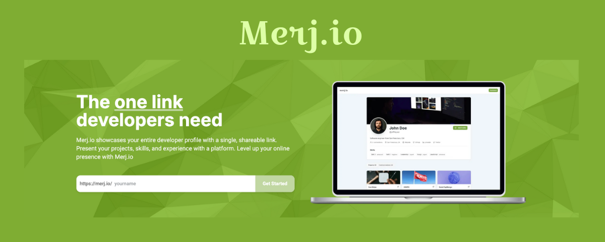
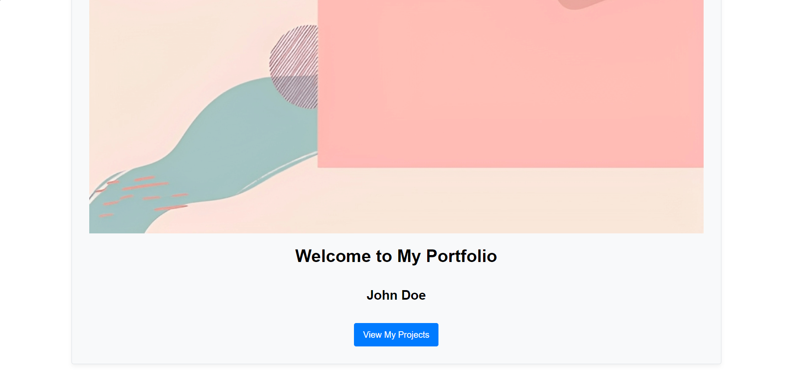
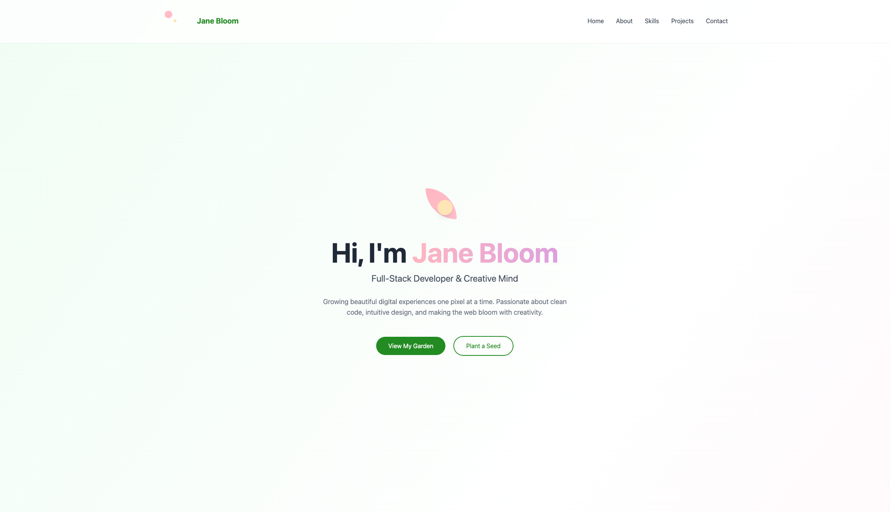
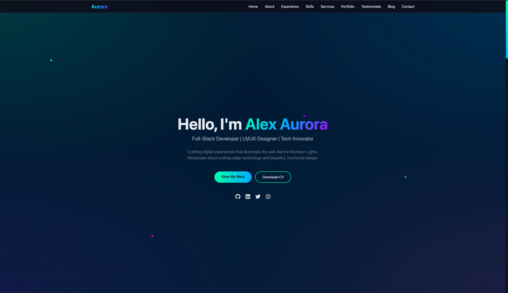

## [Ad] Try Merj for free

<a href="https://merj.io?ref=first-contribution">
  
</a>

# 🎨 Freefolio - Free Portfolio Website Templates

<p align="center">
  
  
  
</p>

<p align="center">
  <a href="https://github.com/OSSPhilippines/freefolio/blob/main/CONTRIBUTING.md">
    
  <a href="https://github.com/OSSPhilippines/freefolio/blob/main/LICENSE">
    
  <a href="https://github.com/OSSPhilippines/freefolio/blob/main/CODE_OF_CONDUCT.md">
    
  <a href="https://github.com/OSSPhilippines/freefolio/stargazers">
    
  <a href="https://github.com/OSSPhilippines/freefolio/network">
    
  <a href="https://commitizen.github.io/cz-cli/">
    
</p>

<p align="center">
  <strong>Beautiful, responsive, and completely FREE portfolio templates built by the OSSPH community.</strong><br>
  No dependencies, no setup required. Just download, customize, and launch! 🚀
</p>

## ⚡ Features

| Feature | Description |
|---------|-------------|
| 🚀 **Lightning Fast** | Pure HTML/CSS with no framework overhead |
| 💰 **100% Free** | MIT licensed, free forever |
| 📱 **Mobile Responsive** | Looks great on all devices |
| 🔍 **SEO Friendly** | Properly structured with meta tags |
| 🌐 **Universal Compatibility** | Works on any web server |
| 📦 **Zero Dependencies** | No npm install, no build process |
| 🎨 **Easy to Customize** | Simple HTML/CSS structure |
| 🌙 **Dark Mode Support** | Many templates include dark themes |

## GitAds Sponsored
[](https://gitads.dev/v1/ad-track?source=ossphilippines/freefolio@github)

## 🎨 Available Templates (15+)

<h3><a href="https://freefolio.web.app/hacker" target="_blank">Hacker</a></h3>


<h3><a href="https://freefolio.web.app/indify" target="_blank">Indify</a></h3>


<h3><a href="https://freefolio.web.app/plain" target="_blank">Plain</a></h3>

  
<h3><a href="https://freefolio.web.app/beginner" target="_blank">Beginner</a></h3>


<h3><a href="https://freefolio.web.app/outlines" target="_blank">Outlines</a></h3>


<h3><a href="https://freefolio.web.app/clean" target="_blank">Clean</a></h3>


<h3><a href="https://freefolio.web.app/deepsea" target="_blank">Deep Sea</a></h3>


<h3><a href="https://freefolio.web.app/simple" target="_blank">Simple</a></h3>


<h3><a href="https://freefolio.web.app/dark-hack" target="_blank">Dark Hack</a></h3>


<h3><a href="https://freefolio.web.app/ingolfur" target="_blank">Ingólfur</a></h3>


<h3><a href="https://freefolio.web.app/anime" target="_blank">Anime</a></h3>


<h3><a href="https://freefolio.web.app/easy" target="_blank">Easy</a></h3>


<h3><a href="https://freefolio.web.app/classic" target="_blank">Classic</a></h3>


<h3><a href="https://freefolio.web.app/flower" target="_blank">🌸 Flower (New)</a></h3>


<h3><a href="https://freefolio.web.app/aurora" target="_blank">🌌 Aurora (New)</a></h3>


## 🚀 Quick Start

1. **Browse** the templates at [freefolio.web.app](https://freefolio.web.app)
2. **Choose** a template that fits your style
3. **Download** the template folder
4. **Customize** the HTML with your information
5. **Deploy** to any web hosting service

That's it! No npm install, no build process, just pure HTML/CSS goodness.

## 🎯 Template Categories

- **Minimal**: Clean, simple designs focused on content
- **Dark Theme**: Modern dark-mode templates
- **Creative**: Unique, artistic designs with animations
- **Professional**: Corporate-ready, formal layouts

## 😤 I own the content in your templates

If any of the content from our collection is owned by you or your organization and has no proper attribution to the owner, please send us an email at opensourcesoftwareph@gmail.com. This happens sometimes and we apologize for the oversight.

## 🎯 Contributing

We welcome contributions! Whether it's a new template, bug fix, or improvement to existing templates.

Please read the project's [contributing guide](./CONTRIBUTING.md) for the process for submitting pull requests.

### How to Contribute a Template

1. Fork the repository
2. Create a new folder for your template
3. Add your `index.html` and any assets
4. Follow our template guidelines
5. Submit a pull request

## 📋 Code of Conduct

This project and everyone participating in it are governed by the [Contributor Covenant Code of Conduct](./CODE_OF_CONDUCT.md). By participating, you agree to abide by this code of conduct.

## 📃 License

Freefolio is licensed under the MIT License - see the [LICENSE](LICENSE) file for details.

## 💻 Development

For contributors who want to use the development tools:

```bash
# Install development dependencies
npm install

# Run TailwindCSS in watch mode (for main gallery)
yarn dlx tailwindcss -i global.css -o index.css --watch

# Use Commitizen for commits
npx cz
```

## 🤔 Need Help?

- **Setup Help**: Not a developer? Contact us at [ossph.org](https://ossph.org)
- **Issues**: Report bugs or request features in [GitHub Issues](https://github.com/OSSPhilippines/freefolio/issues)
- **Community**: Join the OSSPH community for support and discussions

## 🌟 Support the Project

- ⭐ Star this repository
- 🔄 Share with others who need portfolio templates
- 🤝 Contribute a template
- 💬 Spread the word about OSSPH

<!-- GitAds-Verify: I945ALUM1XCZIG1KF2D1TFPEUZQCAYWL -->
