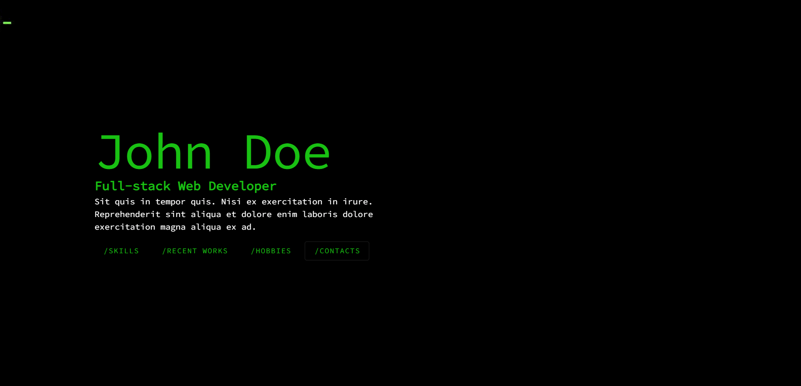
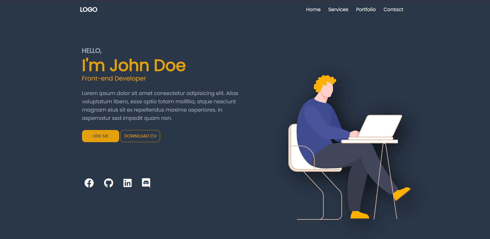
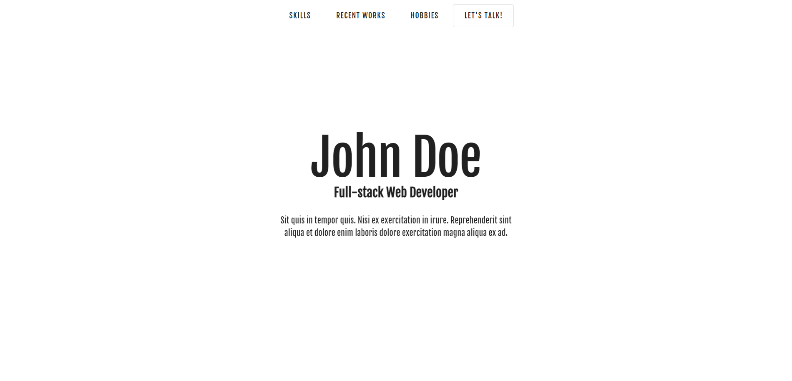
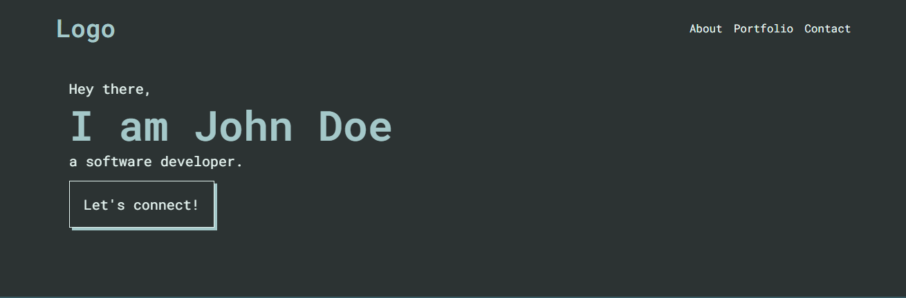
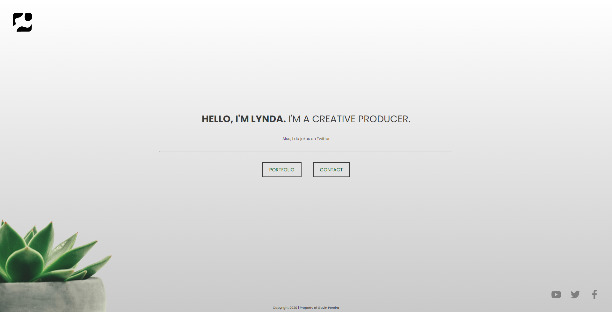

# Free Portfolio Website Templates

A collection of **100% FREE** to use portfolio website templates.

## Features

✅ Fast

✅ FREE

✅ Mobile Responsive

✅ SEO Friendly

✅ Compatible with any web server

✅ 0 Dependencies

## Templates

- [Hacker](https://ossphilippines.github.io/freefolio/hacker)
  

- [Indify](https://ossphilippines.github.io/freefolio/indify)
  

- [Plain](https://ossphilippines.github.io/freefolio/plain)
  
  
- [Beginner](https://ossphilippines.github.io/freefolio/beginner)

- [Outlines](https://ossphilippines.github.io/freefolio/outlines)
  

- [Clean](https://ossphilippines.github.io/freefolio/clean)
  

## I am not a web developer, how do I setup my portfolio website?

Need help with setting up your portfolio website?

Contact us at https://ossph.org
