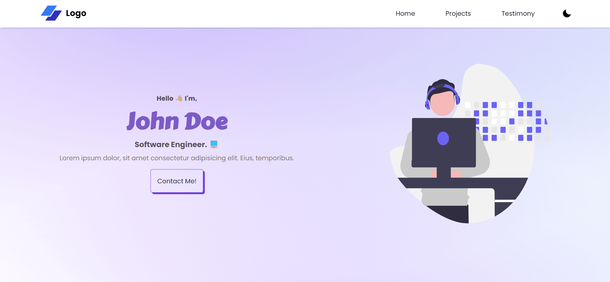

# Beginner - Free Portfolio Website Template

A beginner friendly portfolio template.

### ⚙️ Tech Stack:

  

---

    
Light mode: 💡

    

    
Dark mode: 🌙

    

## ⚡ Features

✅ Fast

✅ FREE

✅ Mobile Responsive

✅ SEO Friendly

✅ Compatible with any web server

✅ 0 Dependencies

## 📃 License

## 🤔 I am not a web developer, how do I setup my portfolio website?

> Need help with setting up your portfolio website?

> Contact us at https://ossph.org