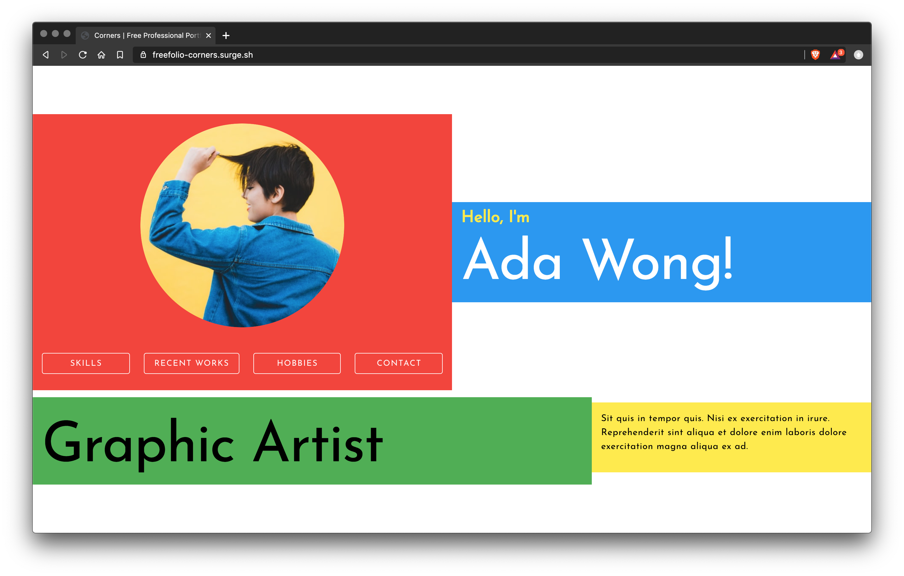

# Corners - Free Portfolio Website Templates

A colorful template with simplicity of flat design!

## Features

✅ Fast

✅ FREE

✅ Mobile Responsive

✅ SEO Friendly

✅ Compatible with any web server

✅ 0 Dependencies

## How to use

1. Close or manually download the code.
2. Under the "plain" folder, edit the file `config.js`.
3. Open the `index.html` file in your browser.
4. If everything looks good, upload it to your server.

## I am not a web developer, how do I setup my portfolio website?

> Need help with setting up your portfolio website?

Contact me @ jofftiquez@gmail.com :)
