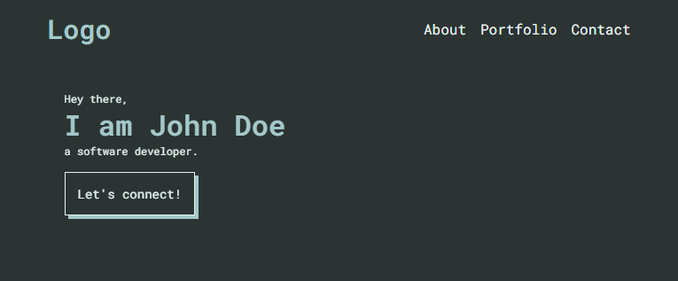

# Outlines Portfolio Template

A responsive and minimalistic portfolio template that anyone can use 💞.

## Features

✅ Fast

✅ FREE

✅ Mobile Responsive

✅ SEO Friendly

✅ Compatible with any web server

## How to use

1. Close or manually download the code.
2. Open the `index.html` file in your browser.
3. If everything looks good, upload it to your server.

## I am not a web developer, how do I setup my portfolio website?

> Need help with setting up your portfolio website?

Contact us at https://ossph.org
